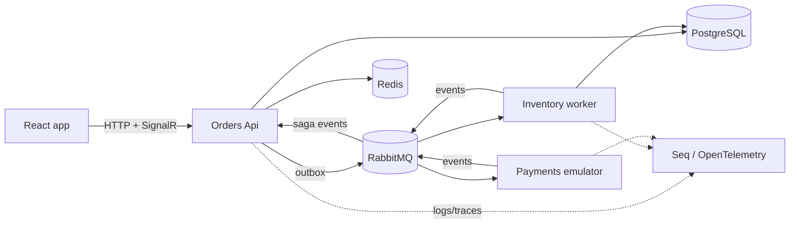
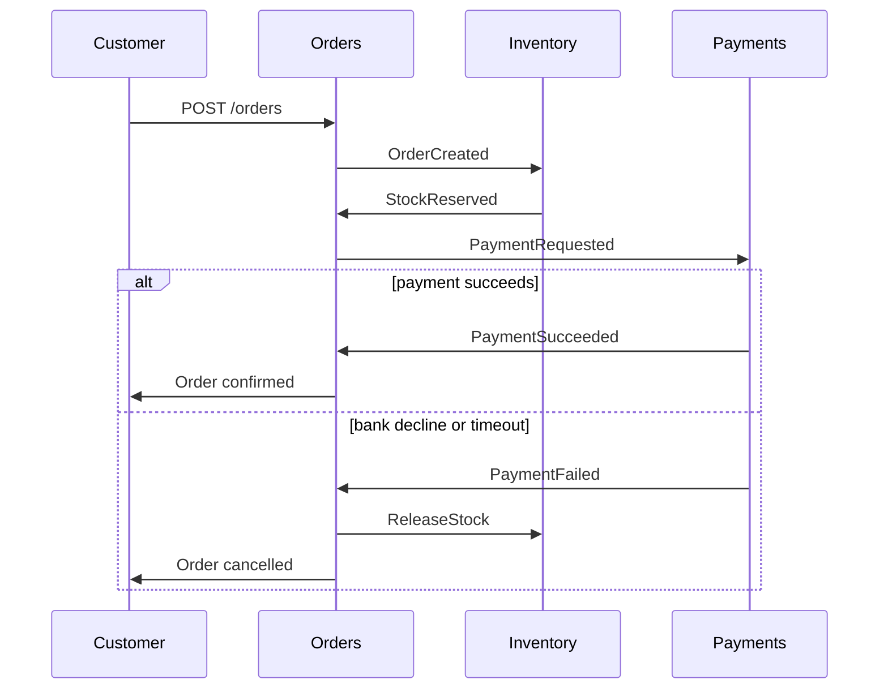

# OrderFlow

An order-processing platform built to practice and demonstrate production-grade backend engineering on .NET 10:
reliable messaging with RabbitMQ, a saga with compensations, the transactional outbox/inbox pattern, and operating everything in Docker.

> Status: stage 0 (foundation). See [docs/BACKLOG.md](docs/BACKLOG.md) for progress and [docs/PLAN.md](docs/PLAN.md) for the full plan.

## Architecture (target)



Order saga (happy path and compensation):



More detail: [docs/architecture.md](docs/architecture.md). Decisions: [docs/adr/](docs/adr/).

## Quick start

Requirements: .NET 10 SDK, Docker Desktop, Node.js (for the frontend, later stages).

```bash
docker compose up -d        # PostgreSQL, RabbitMQ, Redis, Seq, API (reads .env)
```

Create a `.env` file in the repository root (it is git-ignored; local development values only):

| Variable | Example | Purpose |
|---|---|---|
| `POSTGRES_USER`, `POSTGRES_PASSWORD`, `POSTGRES_DB` | `postgres`, `postgres`, `orderflow` | PostgreSQL credentials and database name |
| `RABBITMQ_USER`, `RABBITMQ_PASSWORD` | `orderflow`, `orderflow` | RabbitMQ credentials |
| `POSTGRES_PORT`, `RABBITMQ_PORT`, `RABBITMQ_UI_PORT`, `REDIS_PORT`, `SEQ_UI_PORT`, `API_PORT` | `5442`, `5682`, `15682`, `6389`, `5351`, `8085` | Host ports (change them if they clash with other local projects) |
| `ASPNETCORE_ENVIRONMENT` | `Production` | Environment of the API container |

| Service | URL |
|---|---|
| API health | http://localhost:8085/health/live, http://localhost:8085/health/ready |
| RabbitMQ UI | http://localhost:15682 |
| Seq (logs) | http://localhost:5351 |

Run the API from the IDE or CLI against the containers:

```bash
docker compose up -d postgres rabbitmq redis seq
dotnet user-secrets set "ConnectionStrings:Postgres" "Host=localhost;Port=5442;Database=<db>;Username=<user>;Password=<password>" --project src/OrderFlow.Api
dotnet user-secrets set "RabbitMq:User" "<user>" --project src/OrderFlow.Api
dotnet user-secrets set "RabbitMq:Password" "<password>" --project src/OrderFlow.Api
dotnet run --project src/OrderFlow.Api
```

Build and test:

```bash
dotnet build OrderFlow.sln
dotnet test OrderFlow.sln
```

## Repository layout

```
src/    Api, Application, Domain, Infrastructure, Contracts (workers are added in stage 2)
tests/  UnitTests, IntegrationTests (Testcontainers)
docs/   PLAN, BACKLOG, architecture, ADRs, interview notes
```

## Demo script (3 minutes, filled in as features land)

1. `docker compose up -d`, show healthy services in `docker compose ps`.
2. Create an order in the UI, show the live timeline.
3. Switch the Payments emulator to "bank decline", create an order, show the compensation (`ReleaseStock`).
4. Stop Payments, create an order, show messages accumulating in RabbitMQ; start Payments, show them drain.
5. Open the trace of a failed order in Seq / OpenTelemetry and find the cause.

## Working with Claude Code

This project is developed with Claude Code. Project rules live in [CLAUDE.md](CLAUDE.md); the owner reviews and explains every stage (ADRs, walkthroughs, interview notes).
