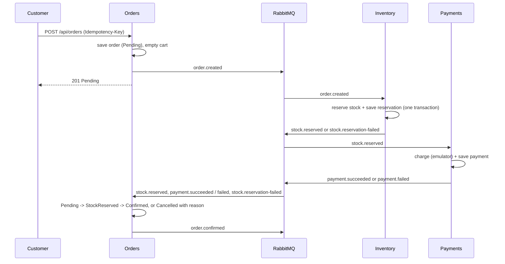

# Architecture

Living document, updated at the end of each stage. Rationale for individual decisions is in `docs/adr/`.

## Services

| Service | Project | Owns | Talks to |
|---|---|---|---|
| **Orders** (HTTP API + consumer) | `OrderFlow.Api`, `Application`, `Domain`, `Infrastructure` | catalog (name, price), carts, orders, users, schema `orders` | PostgreSQL, Redis (catalog cache), RabbitMQ |
| **Inventory** (worker) | `OrderFlow.Inventory` | stock and reservations, schema `inventory` | PostgreSQL, RabbitMQ |
| **Payments** (worker) | `OrderFlow.Payments` | payments, schema `payments`; emulator mode in Redis key `payments:mode` | PostgreSQL, Redis, RabbitMQ |
| Shared libraries | `OrderFlow.Contracts` (messages, topology, demo catalog), `OrderFlow.Messaging` (RabbitMQ publisher/consumer) | | |

One PostgreSQL database, one schema and one `DbContext` per service; services never read each other's tables.

### Orders layers (Clean Architecture)

| Project | Responsibility | Depends on |
|---|---|---|
| `OrderFlow.Domain` | entities, value objects, status rules | nothing |
| `OrderFlow.Application` | commands, queries, handlers, validators (CQRS with MediatR) | Domain |
| `OrderFlow.Infrastructure` | EF Core, Redis, JWT, health checks, RabbitMQ adapters | Application, Contracts, Messaging |
| `OrderFlow.Api` | HTTP host, auth, composition root | Application, Infrastructure |

Dependencies point inward. Domain and Application never reference Infrastructure or the broker.

## The order flow (choreography, ADR 0006)

Order statuses: `Pending -> StockReserved -> Paid -> Confirmed`, or `Cancelled` (stock refused, payment failed).
The customer's request returns as soon as the order is accepted; the status changes asynchronously (the UI polls until SignalR in stage 4).

## Messaging topology

One durable **topic exchange** `orderflow.events`; the routing key is the message type. One durable **queue per consuming service**; its binding keys are the messages it handles. Definitions live in code (`OrderFlow.Contracts/Topology.cs`) and every service declares what it needs on start (declaring is idempotent). Orders declares ALL queues so messages are kept even if the consuming service has not started yet.

| Queue | Consumer | Bound routing keys |
|---|---|---|
| `orders.events` | Orders | `stock.reserved`, `stock.reservation-failed`, `payment.succeeded`, `payment.failed` |
| `inventory.events` | Inventory | `order.created` |
| `payments.events` | Payments | `stock.reserved` |

`order.confirmed` has no consumer yet (a notification service could use it).

**Envelope** (AMQP properties, not the JSON body): `message-id`, `correlation-id` (one per business flow, taken from the HTTP request), `type` = routing key, `timestamp`, headers `causation-id` (the message that caused this one) and `version`. Messages are persistent; publishing waits for the broker's confirm and uses `mandatory` so an unroutable message raises an error instead of vanishing.

**Consumers**: manual ack, prefetch 10, one message at a time. Handler success -> ack. Handler exception -> short delay, then nack with requeue. Unknown key or unreadable body -> nack without requeue. Graceful stop cancels the consumer, waits for the message in progress, then closes. A consumer refuses to start if a bound key has no handler.

## Guarantees and known gaps (until stage 3)

- **At-least-once delivery.** Handlers are safe to repeat: reservations and payments are keyed by order id (a repeat re-publishes the stored answer); order status commands ignore repeats and late events.
- **Gap 1:** Orders publishes `order.created` after its own commit. If the process dies in between, the order stays `Pending`. (Outbox in stage 3.)
- **Gap 2:** a handler that always fails requeues forever. (Retry with TTL and a dead-letter queue in stage 3.)
- **Gap 3:** when payment fails the reserved stock is not released. (`ReleaseStock` compensation in stage 3.)
- **Gap 4:** no timeout for a payment that never answers. (Stage 3.)

## Runtime topology (Docker Compose)

`api`, `inventory`, `payments` (one parametrized Dockerfile, `--build-arg PROJECT=...`), plus `postgres`, `rabbitmq`, `redis`, `seq`. Infrastructure services have healthchecks and the .NET services wait for them. Workers have no HTTP endpoint and therefore no healthcheck yet.

Observability today: Serilog to console and Seq, every log line carries `Service` and (for requests and messages) `CorrelationId`; RabbitMQ management UI shows queue depth.
